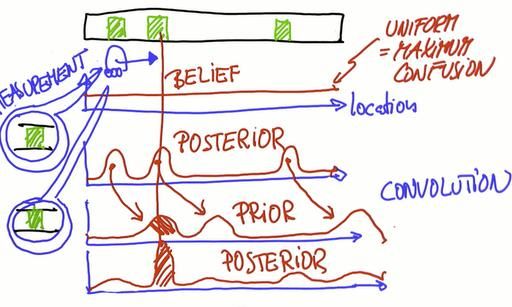

## Lesson 1 : Localization

In this lesson, we learnt about-
* Markov Localization
* Probabilities
* Bayes Rule
* Total Probability
* Histogram Filters
* We wrote a sense and move program in which sense involves BAYES THEOREM (product) and 
  move involves TOTAL PROBABILITY (convolution).
* Finally we wrote a program on localization 

Finding the location of a vehicle using GPS is not very efficient because it gives large error in measurements.We want the error to be small (e.g, 2cm - 10cm) for the vehicle to avoid collisions and diversions.This can be done using *localization*.

The first 3 lessons deal with localization using histogram filter (lesson 1), kalman filter (lesson 2) and particle filter (lesson 3).In all these filters, the underlying principle is same.

Initially, the vehicle/robot is uncertain about it's surrounding so it will assume the measurements are uniformly distributed.That is, the probability distribution over the environment landmarks(the objects to be sensed/observed)is a straight line.This is called as robot's *belief*.After one measurement, suppose the robot senses a landmark.Notice that this is an important step and will be repeated again and again.In this step(sensing step), the robot accumulates information.Unlike in the initial condition, the robot has now some certainty about the location of the landmark.

This new measurement is called as *posterior* and is shown by the bell-shaped probability distribution curve where the bump shows the robot's maximum confidence about the measurement of the landmark.

Now suppose the robot makes a movement and is near the next landmark.The posterior will shift in the direction of the movement and now is called *prior*.Although the position of the bumps will remain same as before, the hights will be a little flattened because of the uncertainty in the new measurements.Now comes the second important step called *convolution*.In this step, we add the posterior and prior to form new function.Put it simply, we overlap the two functions and produce a new one.The new function will have one major bump which means that the robot is now even more certain about the new location.Other bumps would be very much flattened.

The overall picture is that measurements/sensing accumulates information about the surrounding and increases certainty whereas motion adds noise/uncertainty.This is very natural intuition because while measuring, major part of the measurement would be true and only some part will be errorneous given the noisy sensors used.Whereas, while making motion, it's hard to *infer* the new location as it is totally based on the previous location.

