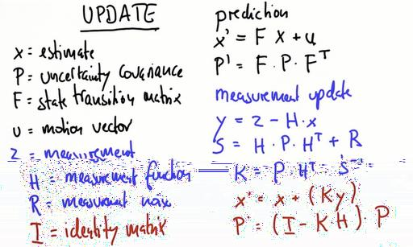

# Lesson 2 : Kalman Filters

The   Kalman   Filter   represents   all distributions   of   the   Gaussians   and  iterates two things:
* Measurement updates (product)
* Motion updates (predict, addition)

The state estimates are represented by gaussians with mean *mu* and variance *sigma_squared*.

# Measurement Update

Suppose the robot measures a vehicle in it's front.This is represented by a gaussian with narrow bump because measurement means increased information(increased confidence).Let the mean of this gaussian be *nu* and the variance be *r_squared*.The resulting new gaussian will be the multiplication of these two gaussian.The result is shown below:

mu_new = (mu*r_squared + nu*sigma_squared)/(sigma_squared + r_squared)

sigma_squared_new = (sigma_squared*r_squared)/(sigma_squared +  r_squared)

# Motion Update

Now the robot takes a step in a direction.This will add noise to the robots current belief and we need to update it.The update is noisy because the motion has it's own gaussian noise.The resulting posterier is just the addition of current state and the motion noise.It is shown below:

mu_new = mu + nu

sigma_squared_new = sigma_squared + r_squared

This is called convolution step.