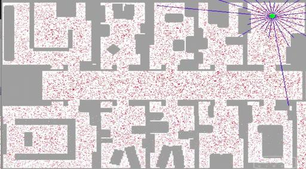

# Lesson 3 : Particle Filters

Particle filter is another way to localize a robot.We maintain a list of particles (e.g, of the order of a 1000).These are scattered uniformly in the environment.Each particle has a *[x,y,orient]* tuple maintained with it.Suppose we have a robot at location *[x_r,y_r,orient_r]*.Assume that there are 4 landmarks and these landmarks are at distances z1,z2,z3,z4 from the robot.

Based on which particle is closer to the robot, each particle is assigned an *importance weight*.How do we get this importance weight? 

Let's pick a particle at random.The landmarks distances from this particle is say z1_p, z2_p, z3_p and z4_p.If the particle is not at the same location as the robot itself, there is surely a mismatch in the actual measurements *z1, z2, ...* and *z1_p, z2_p, ...*.The closer the particle is to the robot, the larger the importance weight.

After we've assigned the weights, next we want to select these particles with *replacement*.Chosing by replacement is a term in probability/permutation/combination where we pick an object from the set of objects and then put it back.This way, we can chose it again.In particle filter case, the particles are chosen with the probability proportional to their weights.Meaning, the ones with higher weights will be choses more often than the ones with lower weights.This process is called *resampling*.

After several iterations, we observe that the particles are clustered around the exact location of the robot and it is said to have been localized.

All these filters - histogram, kalman and particle follow the same two basic theorems - Bayes and Total probability.